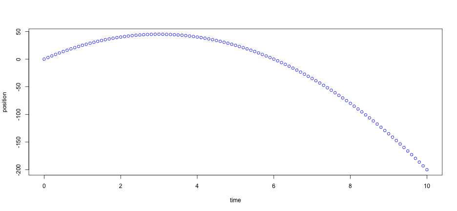

## The Problem

Almost all physics classes show the following equations:

1. $$x_f = x_i + v_i t + \frac{1}{2} a t^2$$
2. $$v_f = v_i + a t$$
3. $$\Delta x = \frac{1}{2} \left( v_i + v_f \right) t$$
4. $$v^2_f = v^2_i + 2 x \Delta x$$

--- .class #id 

## Inadequate Solutions

Flashing plots of kinemeatics data for different situations is pretty common  This shows the height of the ball as a function of time that is thrown straight up with 10 m/s.  

Mastered it yet?

 

--- .class #id 

## Showing The Change
<iframe src = 'https://bryantravissmith.shinyapps.io/1DKin/' height='600px'></iframe>

--- .class #id 

## Feel Free to Share

With the shiny 1DKinPlot app student can finally see how changing the variables change
the resultings plots and behaviors of objects in 1D motion.   

[https://bryantravissmith.shinyapps.io/1DKin/](https://bryantravissmith.shinyapps.io/1DKin/)

--- .class #id 

